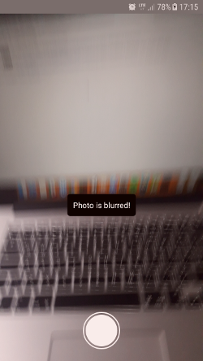
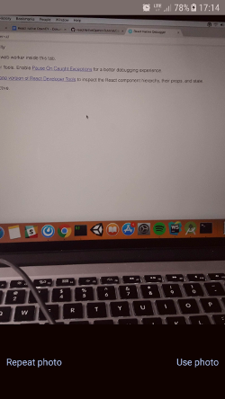

 
<h1 align="center">
  react-native-opencv-tutorial
</h1>

  A fully working example of the OpenCV library used together with React Native.

  <strong>
    <a href="https://brainhub.eu/blog/opencv-react-native-image-processing/">Blog post</a> | 
    <a href="https://brainhub.eu/contact/">Hire us</a>
  </strong>

  
  

## What this tutorial is about
This tutorial is how to use React Native together with OpenCV for image processing. This example uses native Java and Objective-C bindings for OpenCV. In this example we use the device's camera to take a photo and detect whether the taken photo is clear or blurred.

## Demo

The examples below show the situation right after taking a photo. The first one shows what happens if we take a blurry photo and the second one is the situation after we took a clear photo and are able to proceed with it to do whatever we want.

## Blog post

https://brainhub.eu/blog/opencv-react-native-image-processing/

## Prerequisites

1. XCode
2. Android Studio

## How to run the project

1. Clone the repository.
2. `cd cloned/repository/path`
3. `npm i` or `yarn`
4. `react-native link`
5. Run `./downloadAndInsertOpenCV.sh`.
6. Download manually the Android pack from https://opencv.org/releases.html (version 3.4.1).
7. Unzip the package.
8. Import OpenCV to Android Studio, From File -> New -> Import Module, choose sdk/java folder in the unzipped opencv archive.
9. Update build.gradle under imported OpenCV module to update 4 fields to match your project's `build.gradle` 

	a) compileSdkVersion 
	b) buildToolsVersion 
	c) minSdkVersion 
	d) targetSdkVersion.

10. Add module dependency by Application -> Module Settings, and select the Dependencies tab. Click + icon at bottom, choose Module Dependency and select the imported OpenCV module. For Android Studio v1.2.2, to access to Module Settings : in the project view, right-click the dependent module -> Open Module Settings.
11. `react-native run-ios` or `react-native run-android`.

### Additional notes
In case of any `downloadAndInsertOpenCV.sh ` script related errors, please, check the paths inside this file and change them if they do not match yours.
If this script does not run at all since it has no permissions, run `chmod 777 downloadAndInsertOpenCV.sh`.

If you do not have `React Native` installed, type `npm i -g react-native-cli` in the terminal.

### License

reactNativeOpencvTutorial is copyright © 2018-2020 [Brainhub](https://brainhub.eu/?utm_source=github) It is free software, and may be redistributed under the terms specified in the [license](LICENSE.MD).

### About

reactNativeOpencvTutorial is maintained by the Brainhub development team. It is funded by Brainhub and the names and logos for Brainhub are trademarks of Brainhub Sp. z o.o.. You can check other open-source projects supported/developed by our teammates here. 

We love open-source JavaScript software! See our other projects or hire us to build your next web, desktop and mobile application with JavaScript.
